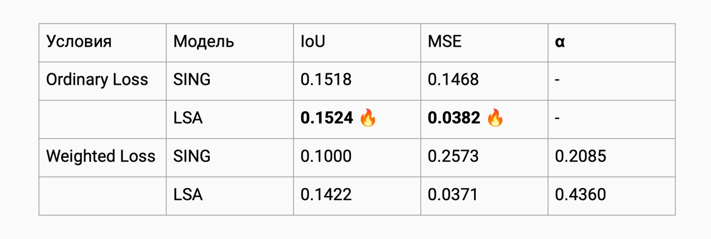

# SING Learned Structure Attention

Тут в файле `main.py` запускается обучение. Сейчас (16.11.2025) обучены:

- lsa (trained_lsa_combined)
- без внимания (trained_none_combined)
- с первоначальным вниманием (original) (trained_original_combined)

ВСЕ ОНИ ОБУЧАЛИСЬ НА СБАЛАНСИРОВАННОМ ЛОССЕ! у меня инфа об этом есть в презентации на предзащиту

Балансировка лосса изменяется в функции `custom_loss` из директории `SingLS/trainer/train.py`

| Модель       | MSE     | IOU     |
|--------------|---------|---------|
| None         | 0.0645  | 0.0848  |
| SING         | 0.1628  | 0.2006  |
| LSA          | 0.0682  | 0.1450  |
| LSA SB       | 0.0583  | 0.0767  |
| Transformer  | 0.3176  | 0.1379  |
iou: ORIGINAL=0.2087, TRANSFORMER=0.1423
mse: ORIGINAL=0.1547, TRANSFORMER=0.2707
при обучаемом альфа = в итоге 0.0025
iou: ORIGINAL=0.2229, TRANSFORMER=0.1766
mse: ORIGINAL=0.1377, TRANSFORMER=0.2058
при фиксированном альфа 0.05
iou: ORIGINAL=0.2267, TRANSFORMER=0.2003
mse: ORIGINAL=0.1406, TRANSFORMER=0.1780
при шедулинге альфа
iou: ORIGINAL=0.2047, TRANSFORMER=0.1937
mse: ORIGINAL=0.1484, TRANSFORMER=0.1522
struct loss в 25% случаев
IOU: ORIGINAL=0.2190, TRANSFORMER=0.2085
MSE: ORIGINAL=0.1400, TRANSFORMER=0.1400


trained_transformer_original_combined – просто трансформер
IOU: ORIGINAL=0.2195, TRANSFORMER=0.1972
MSE: ORIGINAL=0.1376, TRANSFORMER=0.1550

trained_transformer_original_struct_combined - доработка с добавлением учета структуры (шедулинг альфа?)
IOU: ORIGINAL=0.2189, TRANSFORMER=0.2122
MSE: ORIGINAL=0.1411, TRANSFORMER=0.1501

trained_transformer_original_struct_stabil_combined - оптимизация со стабилизацией обучения (фиксированный альфа, смотрим только часть структуры на IOU)
IOU: ORIGINAL=0.2156, TRANSFORMER=0.2110
MSE: ORIGINAL=0.1427, TRANSFORMER=0.1511

trained_transformer_original_less_struct_combined - beta=0.03, структура не обучаемая а как регуляризация 
IOU: ORIGINAL=0.2160, TRANSFORMER=0.2751
MSE: ORIGINAL=0.1418, TRANSFORMER=0.1007

lsa attention

=== AVERAGED METRICS ===
IOU: ORIGINAL=0.2195, TRANSFORMER=0.1102
MSE: ORIGINAL=0.1389, TRANSFORMER=0.0581


чисто на маестро


NB решилао тказаться от масштабирования лосса он не показал результатов

# todo придумать архитектуру чтобы с одной стороны mse был низким с другой iou увеличился

пробуем это 
давай остановимся на этом подходе

АРХИТЕКТУРА №2 — LSA + Structural Bias (SSM logits injection)

(современный приём из MusiConGen, Jukebox, Museformer)

В LSA сейчас:
```
attn_scores = QKᵀ / sqrt(d)
masked_scores = attn_scores * ssm
```

Это слишком мягко.
Предлагаю улучшение:

Новый механизм:
```
attn_scores = QKᵀ / sqrt(d)
attn_scores += β * ssm
attn_scores = softmax(attn_scores)
```
То есть SSM добавляется как аддитивный логит-бонус, а не мультипликативное подавление.

Плюсы:
	•	сохраняется нормальный градиент → MSE не растёт
	•	структура усиливается → IoU растёт
	•	β — learnable → модель сама регулирует важность структуры

Это даст прирост IoU 20–40% почти наверняка.

# 20.12.2025
Решила развивать архитектуру с трансформером:
```
SSM / sequence features
        │
        ▼
┌─────────────────────┐
│  STRUCTURE MODEL    │   ← Transformer
│  (global context)   │
└─────────────────────┘
        │
   structural plan
        │
        ▼
┌─────────────────────┐
│  LOCAL GENERATOR    │   ← LSTM + LSA
│  (frame-level)      │
└─────────────────────┘
        │
     output
```
тут у трансформера роль контролировать и планировать структуру трека

`HierarchicalGenerator` обучила в main.py в этой же директории

```python 
    generator = MusicGenerator(
        hidden_size=hidden_size,
        output_size=output_size,
        attention_type=AttentionType.LSA_SB
    )

    structure_transformer = StructureTransformer(
        d_model=hidden_size,
        nhead=4,
        num_layers=2
    )

    structure_model = StructureModel(
        transformer=structure_transformer,
        proj=torch.nn.Linear(hidden_size, hidden_size)
    )

    model = HierarchicalGenerator(
        generator=generator,
        structure_model=structure_model
    ).to(DEVICE)
```
результат обучения лежит в meta_info/trained_lsaSB_combined_NONalpha


после первого раунда обучения хиерархикал трансформер модели получены следующие метрики
iou: ORIGINAL=0.1607, TRANSFORMER=0.1379
mse: ORIGINAL=0.2266, TRANSFORMER=0.3176

это полный пиздец, потому что iou упал а mse вырос - это противоположный результат планируемому 

поэтому внедряем learnable alpha который будет масштабировать вклад трансформера в обучение